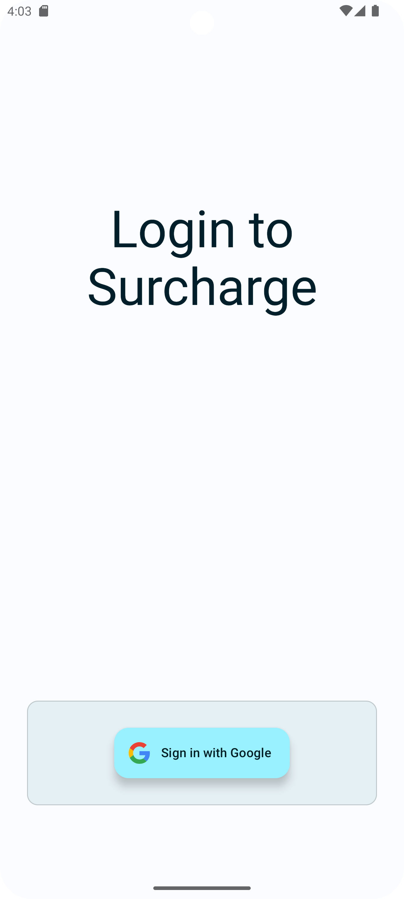
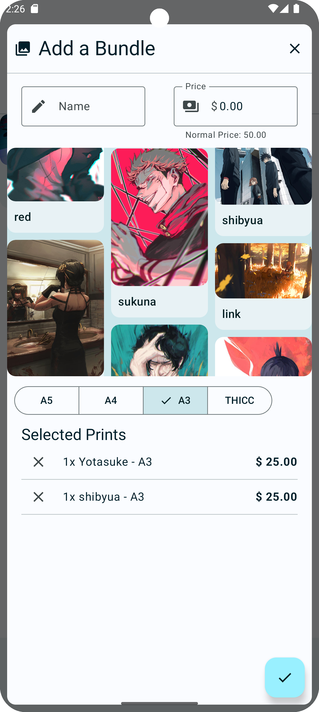
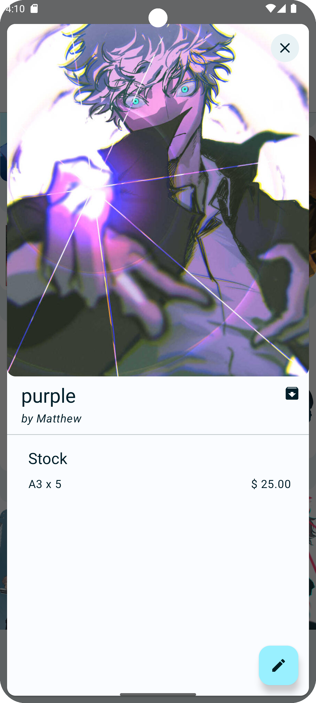
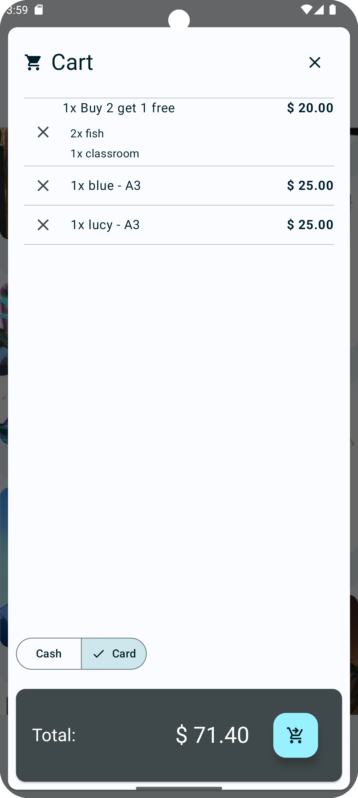
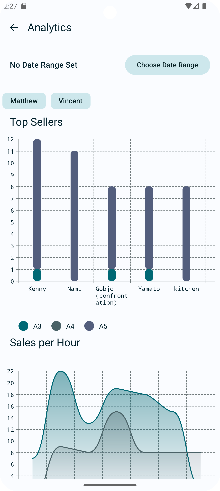

# Surcharge - WIP
A Point of Sales app for android. Intended to be used to track art print sales, especially involving
multiple artists.

# Tech Stack

Written in Kotlin using Jetpack Compose and Material Theme 3 for UI elements. Google single sign on
for authentication. Firebase for synchronous storage across devices. Square account linking and
Square Reader integration for card payments. Cloudinary for image hosting.

## Sample Screenshots

